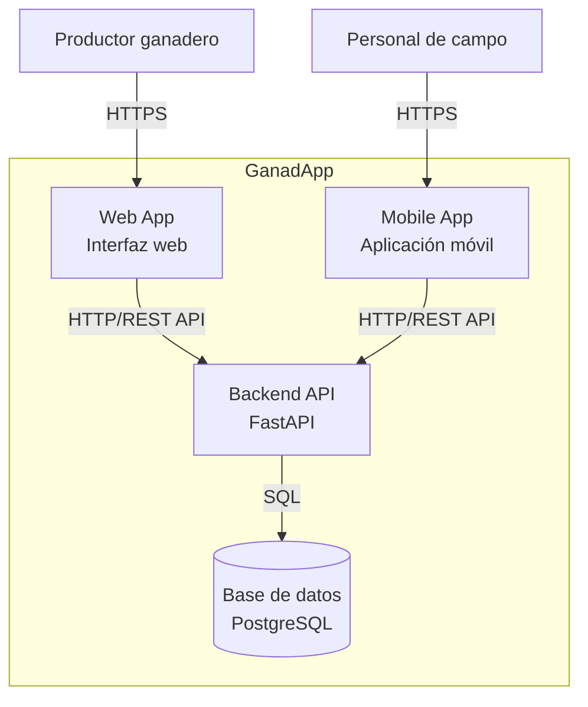

C4 Nivel 2 — Contenedores

Objetivo

Este diagrama representa la estructura interna de GanadApp a nivel de contenedores. Muestra las principales piezas que forman el sistema y las comunicaciones entre ellas.

El diagrama complementa al C4 Nivel 1 (Contexto), que representa cómo GanadApp se relaciona con sus actores y sistemas externos.

Diagrama

Contenedores

Web App

Aplicación web utilizada por los productores ganaderos para interactuar con GanadApp. Se comunica con el Backend API mediante HTTP/REST.

Mobile App

Aplicación móvil destinada al personal de campo. Se comunica con el Backend API mediante HTTP/REST.

Backend API

Backend de GanadApp desarrollado con FastAPI. Centraliza la lógica de negocio y proporciona la API utilizada por la Web App y la Mobile App. También gestiona el acceso a los datos almacenados en PostgreSQL.

Base de datos PostgreSQL

Sistema de persistencia utilizado para almacenar los datos de GanadApp. El Backend API accede a la base de datos mediante SQL.

Comunicaciones

Los usuarios interactúan con GanadApp a través de la Web App o la Mobile App. Ambas aplicaciones se comunican con el Backend API mediante HTTP/REST.

El Backend API se comunica con PostgreSQL mediante SQL para almacenar y recuperar los datos del sistema.