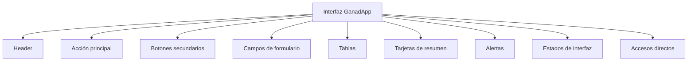

# Componentes UI - GanadApp

## 1. Objetivo

Este documento define los componentes de interfaz de usuario reutilizables de GanadApp.

Los componentes establecidos en este documento constituyen los elementos comunes que permiten construir las diferentes pantallas definidas en los wireframes.

El objetivo es establecer qué componentes forman parte de la interfaz y cuáles son sus características y criterios de uso, evitando definir en este documento los recorridos de interacción propios de cada módulo.

---

## 2. Estructura general de componentes

La interfaz de GanadApp se compone de los siguientes elementos reutilizables:



Estos componentes se combinan de acuerdo con las necesidades de cada pantalla.

---

# 3. Header principal

## 3.1 Definición

El header es el componente común utilizado para identificar el sistema, la pantalla actual y el usuario.

Su estructura es:

```text
+------------------------------------------------------+
| GANADAPP | TÍTULO DE LA PANTALLA | usuario           |
+------------------------------------------------------+
```

## 3.2 Elementos

El header contiene:

* Identificación del sistema: `GANADAPP`.
* Título de la pantalla actual.
* Usuario.

## 3.3 Criterios

* Mantener la misma estructura en las pantallas.
* Mantener la identificación `GANADAPP`.
* Mostrar el título correspondiente a la pantalla.
* Mantener la identificación del usuario.
* No incorporar elementos específicos de un módulo dentro del header.

---

# 4. Acción principal

## 4.1 Definición

La acción principal es el botón que representa la operación de mayor relevancia dentro de una pantalla.

En los wireframes, la acción principal se ubica inmediatamente debajo del header.

## 4.2 Acciones definidas

| Pantalla               | Acción                 |
| ---------------------- | ---------------------- |
| Panel Principal        | Gestión de Animales    |
| Gestión de Productores | + Nuevo productor      |
| Gestión de Animales    | + Nuevo animal         |
| Vacunación             | + Registrar vacunación |
| Stock de insumos       | + Nuevo insumo         |
| Trazabilidad           | + Registrar movimiento |
| Reportes               | Generar reporte        |

## 4.3 Criterios

* Debe existir una acción principal identificable.
* Debe ubicarse debajo del header.
* El texto debe describir directamente la acción.
* Debe mantener una denominación consistente con el módulo.

---

# 5. Botones secundarios

## 5.1 Definición

Los botones secundarios permiten realizar acciones complementarias a la operación principal.

## 5.2 Ejemplos

```text
[ Reintentar ]

[ + Registrar primer animal ]

[ Exportar PDF ]
```

## 5.3 Criterios

* Utilizarse únicamente para acciones complementarias.
* Mantener un texto descriptivo.
* No reemplazar la acción principal.
* Mostrarse únicamente cuando la acción correspondiente esté disponible.

---

# 6. Campos de formulario

## 6.1 Definición

Los campos de formulario permiten ingresar o seleccionar información dentro del sistema.

## 6.2 Componentes definidos

### Usuario

```text
Usuario:
[____________________]
```

### Contraseña

```text
Contraseña:
[____________________]
```

### Animal

```text
Animal:
[____________________]
```

### Vacuna

```text
Vacuna:
[____________________]
```

### Fecha

```text
Fecha:
[____________________]
```

### Origen

```text
Origen:
[____________________]
```

### Destino

```text
Destino:
[____________________]
```

## 6.3 Criterios

* Cada campo debe estar identificado mediante una etiqueta.
* La etiqueta debe permitir comprender qué información se solicita.
* Los campos deben corresponder con los datos definidos para cada operación.
* Mantener una presentación uniforme entre formularios.

---

# 7. Tablas

## 7.1 Definición

Las tablas permiten presentar información estructurada y facilitar su consulta.

## 7.2 Tabla de productores

```text
+------------------------------------------------------+
| Nombre       | Teléfono | Localidad                  |
|------------------------------------------------------|
| Juan         | xxx      | Malargüe                   |
| Ana          | xxx      | Bardas                     |
+------------------------------------------------------+
```

## 7.3 Tabla de animales

```text
+------------------------------------------------------+
| ID | Raza   | Estado | Establecimiento              |
|------------------------------------------------------|
| 01 | Angus  | Sano   | Campo 1                      |
| 02 | Heref. | Alerta | Campo 2                      |
+------------------------------------------------------+
```

## 7.4 Tabla de vacunación

```text
+------------------------------------------------------+
| Animal       | Vacuna       | Fecha                  |
|------------------------------------------------------|
| 01           | Antibrucélica | 20/08/2026             |
+------------------------------------------------------+
```

## 7.5 Tabla de stock

```text
+------------------------------------------------------+
| Insumo       | Cantidad | Estado                     |
|------------------------------------------------------|
| Vacuna       | 10       | OK                         |
| Alimento     | 2        | BAJO                       |
+------------------------------------------------------+
```

## 7.6 Tabla de trazabilidad

```text
+------------------------------------------------------+
| Animal | Origen | Destino | Fecha                    |
|------------------------------------------------------|
| 01     | Campo 1| Campo 2 | 20/08/2026               |
+------------------------------------------------------+
```

## 7.7 Criterios

* Utilizar encabezados identificables.
* Mantener las columnas correspondientes al tipo de información.
* Presentar los datos de forma ordenada.
* Mantener visibles los datos relevantes para la consulta.

---

# 8. Tarjetas de resumen

## 8.1 Definición

Las tarjetas de resumen presentan información estadística o de estado de forma resumida.

Se utilizan en el Panel Principal.

## 8.2 Información

Las tarjetas representan:

```text
Animales: 120
Vacunas pendientes: 8
Stock crítico: 3
```

## 8.3 Criterios

* Presentar información resumida.
* Permitir una lectura rápida.
* Utilizar una estructura homogénea entre tarjetas.
* Priorizar los datos definidos para el resumen principal.

---

# 9. Alertas

## 9.1 Definición

Las alertas permiten destacar situaciones que requieren atención del usuario.

## 9.2 Alertas definidas

```text
[ Vacunación próxima ]

[ Stock bajo ]
```

## 9.3 Criterios

* Mostrar el motivo de la alerta de manera clara.
* Diferenciar la alerta del contenido general.
* Utilizar las alertas para información que requiere atención.
* Mantener textos breves y descriptivos.

---

# 10. Accesos directos

## 10.1 Definición

Los accesos directos permiten ingresar rápidamente a los principales módulos desde el Panel Principal.

## 10.2 Módulos

```text
[ Productores ] [ Animales ] [ Vacunación ]
[ Stock ] [ Trazabilidad ] [ Reportes ]
```

## 10.3 Criterios

* Mantener el nombre de cada módulo.
* Facilitar el acceso directo.
* Utilizar denominaciones consistentes con la navegación general.
* No utilizar nombres diferentes para un mismo módulo.

---

# 11. Estado de carga

## 11.1 Definición

El estado de carga indica que el sistema se encuentra obteniendo información.

## 11.2 Representación

```text
Cargando animales...

[████████████████████████]
```

## 11.3 Criterios

* Informar qué información se está cargando.
* Mantener visible el estado mientras la operación se encuentra en proceso.
* No presentar la ausencia temporal de información como un estado vacío.

---

# 12. Estado vacío

## 12.1 Definición

El estado vacío informa que una consulta fue realizada correctamente pero no existen registros disponibles.

## 12.2 Representación

```text
Aún no hay animales registrados.

[ + Registrar primer animal ]
```

## 12.3 Criterios

* Informar claramente la ausencia de registros.
* Evitar presentar una tabla vacía sin explicación.
* Cuando corresponda, ofrecer una acción para crear el primer registro.

---

# 13. Estado de error

## 13.1 Definición

El estado de error informa que una operación no pudo completarse.

## 13.2 Representación

```text
No se pudieron cargar los animales.

[ Reintentar ]
```

## 13.3 Criterios

* Informar claramente qué operación falló.
* Evitar mensajes ambiguos.
* Proporcionar una acción de recuperación cuando corresponda.

---

# 14. Relación entre componentes

Los componentes se utilizan en las diferentes pantallas de acuerdo con la siguiente relación:

```mermaid
flowchart TD
    A[Panel Principal] --> B[Header]
    A --> C[Acción principal]
    A --> D[Tarjetas de resumen]
    A --> E[Alertas]
    A --> F[Accesos directos]

    G[Productores] --> B
    G --> C
    G --> F2[Tabla]

    H[Animales] --> B
    H --> C
    H --> F3[Tabla]
    H --> I[Estado de carga]
    H --> J[Estado vacío]
    H --> K[Estado de error]

    L[Vacunación] --> B
    L --> C
    L --> M[Formulario]
    L --> N[Tabla]

    O[Stock] --> B
    O --> C
    O --> P[Tabla]

    Q[Trazabilidad] --> B
    Q --> C
    Q --> R[Formulario]
    Q --> S[Tabla]

    T[Reportes] --> B
    T --> C
```



---

# 15. Criterios generales de componentes

Los componentes definidos deben cumplir los siguientes criterios:

* Mantener una estructura consistente.
* Utilizar denominaciones claras.
* Evitar duplicar componentes con la misma función.
* Mantener una ubicación consistente cuando el componente cumpla la misma función.
* Diferenciar claramente acciones principales y secundarias.
* Utilizar estados específicos para carga, ausencia de datos y error.
* Mantener los mismos nombres para los módulos en toda la interfaz.


