# Flujo UX General - GanadApp

## 1. Objetivo

Este documento define los flujos de navegación e interacción de usuario de GanadApp.

Los flujos representan las acciones que realiza el usuario y las respuestas que proporciona el sistema en las principales funcionalidades.

El documento contempla:

* Navegación general.
* Inicio de sesión.
* Panel Principal.
* Gestión de Productores.
* Gestión de Animales.
* Vacunación.
* Stock de insumos.
* Trazabilidad.
* Reportes.
* Estados alternativos de interacción.
* Criterios generales de experiencia de usuario.

La definición visual y estructural de los componentes utilizados en estos flujos se encuentra en `componente-ui.md`.

---

# 2. Navegación general

El Panel Principal funciona como punto central de navegación del sistema.

Desde él se puede acceder a los diferentes módulos mediante la navegación disponible y los accesos directos.

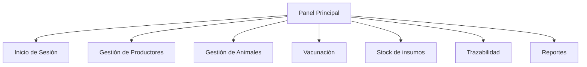

La acción principal del Panel Principal permite acceder directamente a Gestión de Animales.

---

# 3. Flujo de Inicio de Sesión

## 3.1 Objetivo

Permitir al usuario autenticarse y acceder al Panel Principal.

## 3.2 Diagrama de secuencia

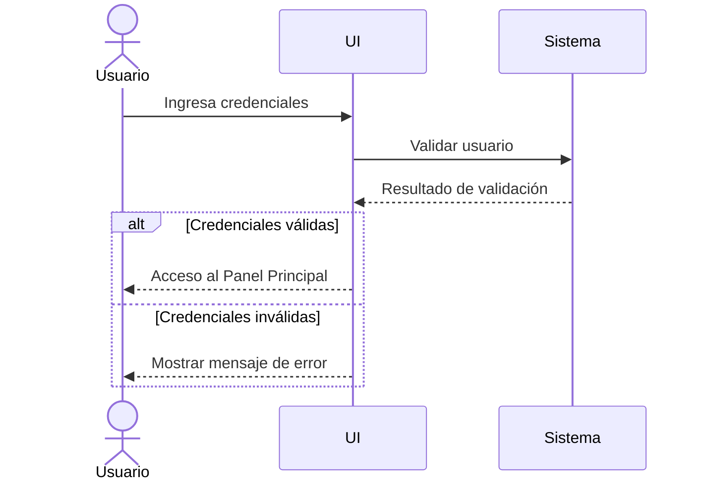

## 3.3 Flujo principal

1. El usuario accede a la pantalla de Inicio de Sesión.
2. Ingresa sus credenciales.
3. La interfaz envía los datos al sistema.
4. El sistema valida las credenciales.
5. Si la validación es exitosa, el usuario accede al Panel Principal.

## 3.4 Flujo alternativo

Si las credenciales no son válidas:

1. El sistema informa el resultado de la validación.
2. La interfaz muestra un mensaje de error.
3. El usuario puede volver a ingresar sus credenciales.

## 3.5 Criterios UX

* Utilizar únicamente los campos necesarios para la autenticación.
* Mostrar mensajes de error claros.
* Validar las credenciales antes de permitir el acceso.
* Permitir volver a intentar el inicio de sesión.
* Dirigir al Panel Principal después de una autenticación exitosa.

---

# 4. Flujo del Panel Principal

## 4.1 Objetivo

Visualizar el estado general del sistema mediante información resumida, alertas pendientes y accesos directos.

## 4.2 Diagrama de secuencia

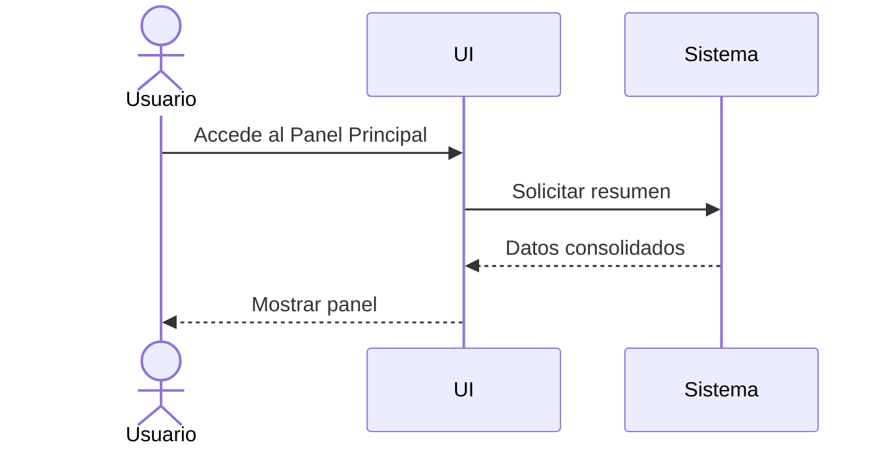

## 4.3 Flujo principal

1. El usuario accede al Panel Principal.
2. La interfaz solicita el resumen de información.
3. El sistema devuelve los datos consolidados.
4. La interfaz presenta el estado general del sistema.
5. El usuario puede acceder a cualquiera de los módulos disponibles.

## 4.4 Información consultada

El Panel Principal presenta:

* Animales.
* Vacunas pendientes.
* Stock crítico.
* Vacunación próxima.
* Stock bajo.

## 4.5 Navegación desde el Panel

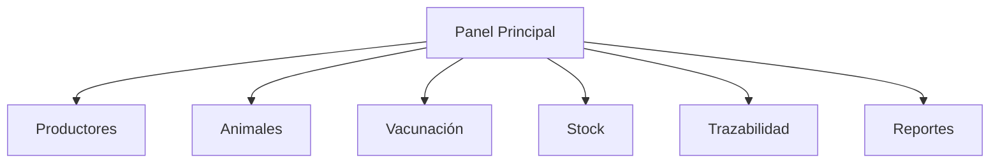

## 4.6 Criterios UX

* Priorizar la información crítica.
* Presentar una visión rápida del estado general.
* Permitir acceso directo a los módulos principales.
* Mantener la acción de Gestión de Animales como acceso principal.

---

# 5. Flujo de Gestión de Productores

## 5.1 Objetivo

Administrar los productores registrados.

## 5.2 Diagrama de secuencia

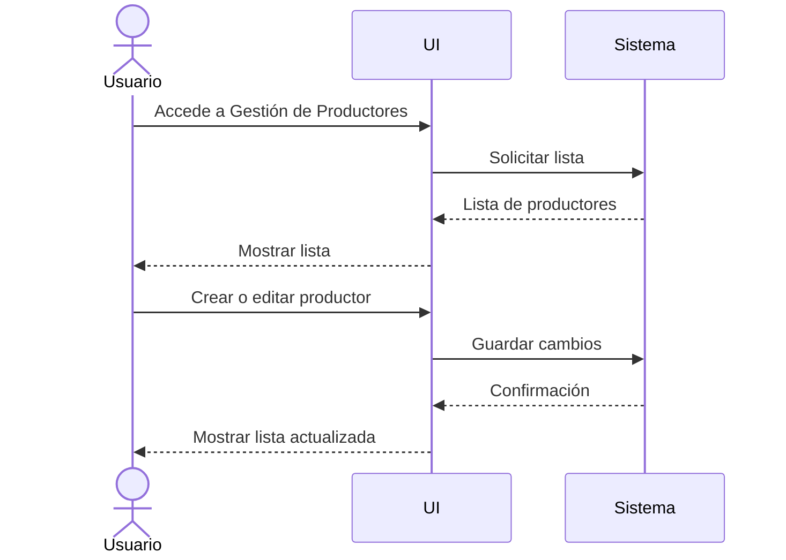

## 5.3 Flujo principal

1. El usuario accede a Gestión de Productores.
2. La interfaz solicita la lista de productores.
3. El sistema devuelve los productores registrados.
4. La interfaz muestra la lista.
5. El usuario selecciona la acción para crear o editar un productor.
6. El usuario completa o modifica la información.
7. La interfaz envía los cambios al sistema.
8. El sistema guarda la información.
9. El sistema devuelve una confirmación.
10. La interfaz muestra la lista actualizada.

## 5.4 Criterios UX

* La lista de productores debe estar disponible para consulta.
* La creación y edición deben seguir una secuencia clara.
* La operación debe confirmarse después del guardado.
* La lista debe actualizarse después de guardar cambios.

---

# 6. Flujo de Gestión de Animales

## 6.1 Objetivo

Administrar animales y consultar su estado sanitario.

## 6.2 Diagrama de secuencia

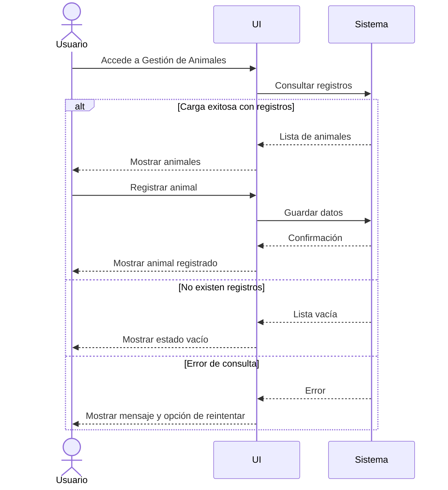

## 6.3 Flujo de consulta

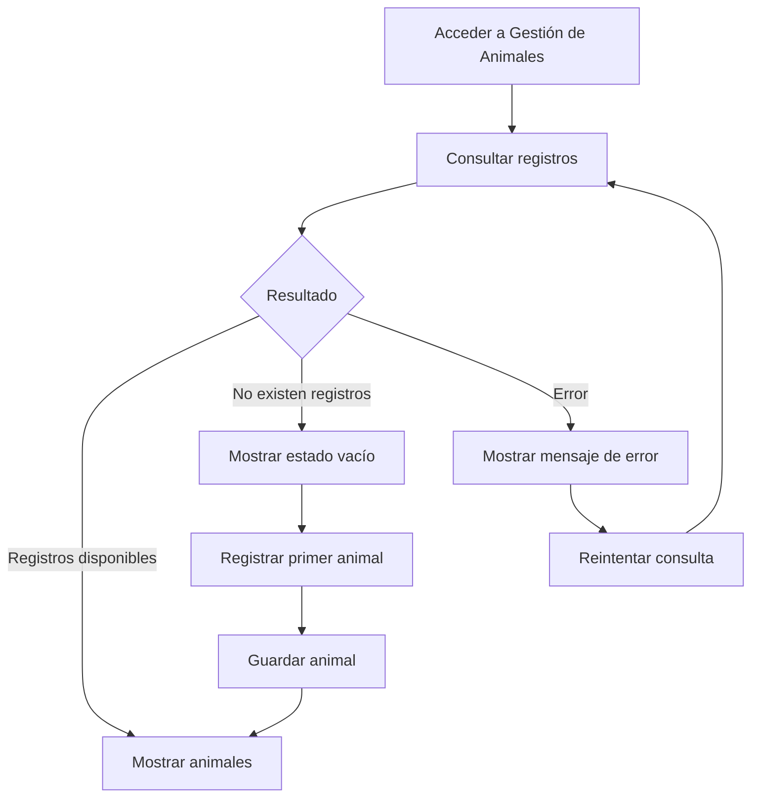

## 6.4 Flujo con registros

1. El usuario accede a Gestión de Animales.
2. La interfaz solicita los registros.
3. El sistema devuelve la lista.
4. La interfaz muestra los animales.
5. El usuario puede iniciar el registro de un nuevo animal.
6. El usuario completa los datos.
7. La interfaz envía los datos al sistema.
8. El sistema guarda el animal.
9. La interfaz muestra el animal registrado.

## 6.5 Flujo sin registros

1. El usuario accede a Gestión de Animales.
2. La interfaz solicita los registros.
3. El sistema devuelve una lista vacía.
4. La interfaz informa que aún no existen animales registrados.
5. El usuario puede iniciar el registro del primer animal.

## 6.6 Flujo con error

1. El usuario accede a Gestión de Animales.
2. La interfaz solicita los registros.
3. Se produce un error durante la consulta.
4. La interfaz informa que no se pudieron cargar los animales.
5. El usuario puede seleccionar `Reintentar`.
6. La consulta vuelve a ejecutarse.

## 6.7 Criterios UX

* Utilizar identificación mediante ID único.
* Mantener visible el estado sanitario.
* Informar el estado de carga durante la consulta.
* Informar cuando no existen registros.
* Ofrecer una acción para registrar el primer animal.
* Informar claramente los errores de consulta.
* Permitir reintentar una consulta fallida.

---

# 7. Flujo de Vacunación

## 7.1 Objetivo

Registrar y consultar vacunaciones.

## 7.2 Diagrama de secuencia

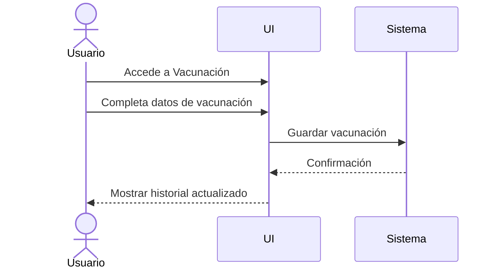

## 7.3 Flujo

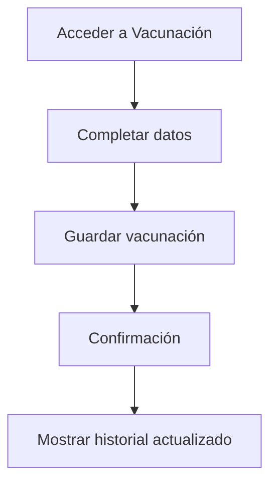

## 7.4 Secuencia

1. El usuario accede a Vacunación.
2. Inicia el registro de una vacunación.
3. Completa los datos correspondientes.
4. La interfaz envía la información al sistema.
5. El sistema guarda la vacunación.
6. El sistema devuelve una confirmación.
7. La interfaz muestra el historial actualizado.

## 7.5 Criterios UX

* Mantener los datos de vacunación claramente identificados.
* Facilitar el registro de una vacunación.
* Mostrar el historial después del registro.
* Confirmar la operación realizada correctamente.
* Mantener la secuencia de registro simple y directa.

---

# 8. Flujo de Stock de insumos

## 8.1 Objetivo

Controlar el inventario de insumos.

## 8.2 Diagrama de secuencia

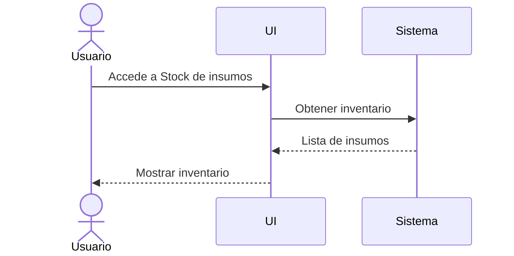

## 8.3 Flujo

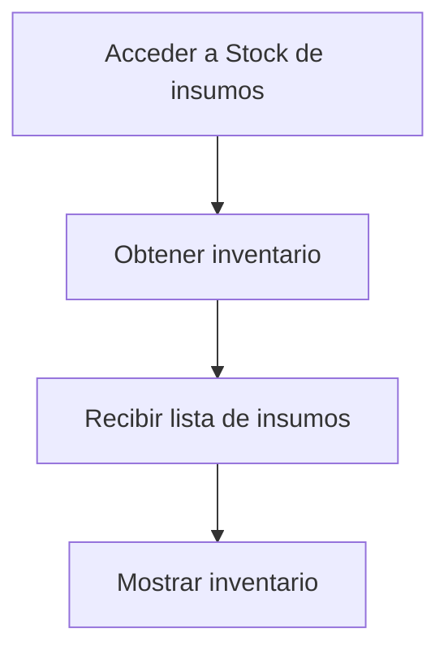

## 8.4 Secuencia

1. El usuario accede a Stock de insumos.
2. La interfaz solicita el inventario.
3. El sistema devuelve la lista de insumos.
4. La interfaz muestra el inventario.

## 8.5 Criterios UX

* Mostrar la cantidad disponible.
* Identificar claramente el estado del stock.
* Priorizar visualmente los insumos con stock bajo.
* Facilitar la consulta del inventario.

---

# 9. Flujo de Trazabilidad

## 9.1 Objetivo

Registrar y consultar los movimientos del ganado.

## 9.2 Diagrama de secuencia

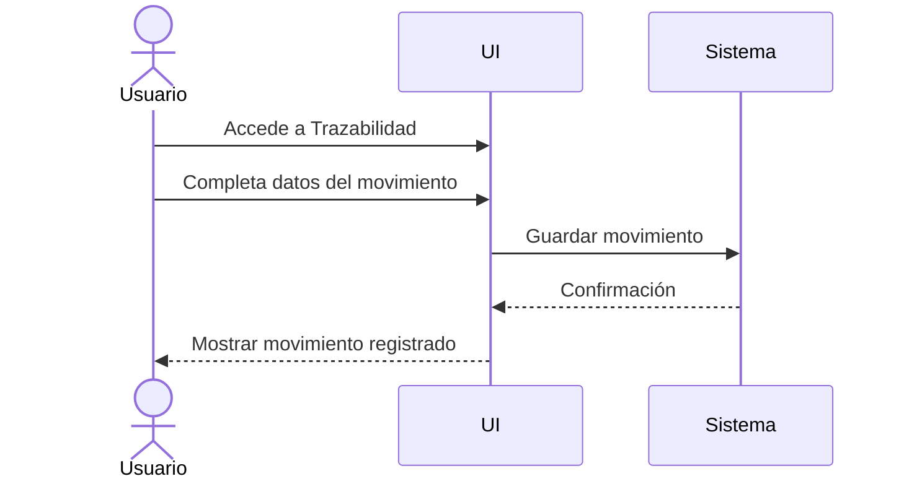

## 9.3 Flujo

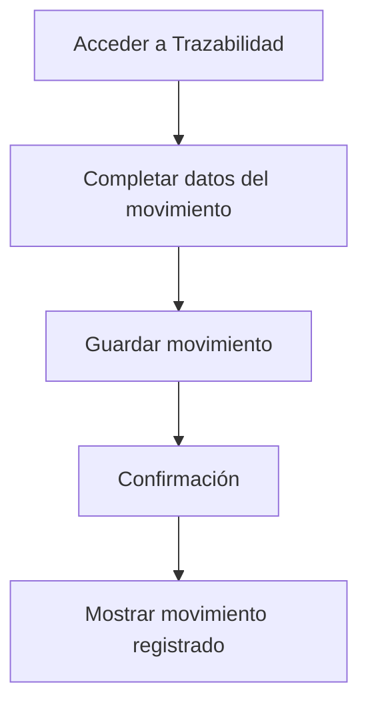

## 9.4 Secuencia

1. El usuario accede a Trazabilidad.
2. Inicia el registro de un movimiento.
3. Completa los datos correspondientes.
4. La interfaz envía la información al sistema.
5. El sistema guarda el movimiento.
6. El sistema devuelve una confirmación.
7. La interfaz muestra el movimiento registrado.

## 9.5 Criterios UX

* Diferenciar claramente origen y destino.
* Mantener visible la fecha del movimiento.
* Facilitar el registro de movimientos.
* Permitir consultar los movimientos recientes.
* Confirmar la operación después del registro.

---

# 10. Flujo de Reportes

## 10.1 Objetivo

Generar análisis del sistema.

## 10.2 Flujo principal

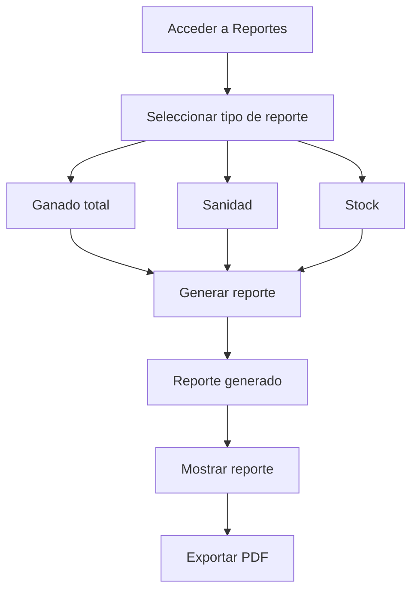

## 10.3 Tipos de reporte

* Ganado total.
* Sanidad.
* Stock.

## 10.4 Secuencia

1. El usuario accede a Reportes.
2. Selecciona el tipo de reporte.
3. Solicita la generación.
4. El sistema genera el reporte.
5. La interfaz muestra el reporte generado.
6. El usuario puede exportarlo en PDF.

## 10.5 Criterios UX

* Presentar claramente los tipos de reporte disponibles.
* Permitir seleccionar el tipo antes de generar.
* Informar cuando el reporte haya sido generado.
* Permitir exportar el reporte después de su generación.

---

# 11. Flujo general de registro

Las operaciones que implican registrar información siguen una estructura común.

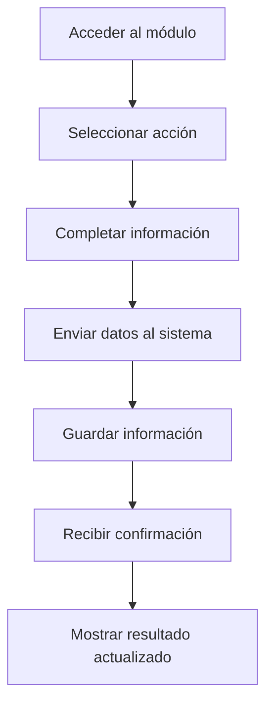

Este patrón se utiliza en los flujos de:

* Productores.
* Animales.
* Vacunación.
* Trazabilidad.

El detalle específico de cada operación se encuentra definido en el flujo correspondiente de este documento.

---

# 12. Flujo general de consulta

Las operaciones de consulta siguen una secuencia común:

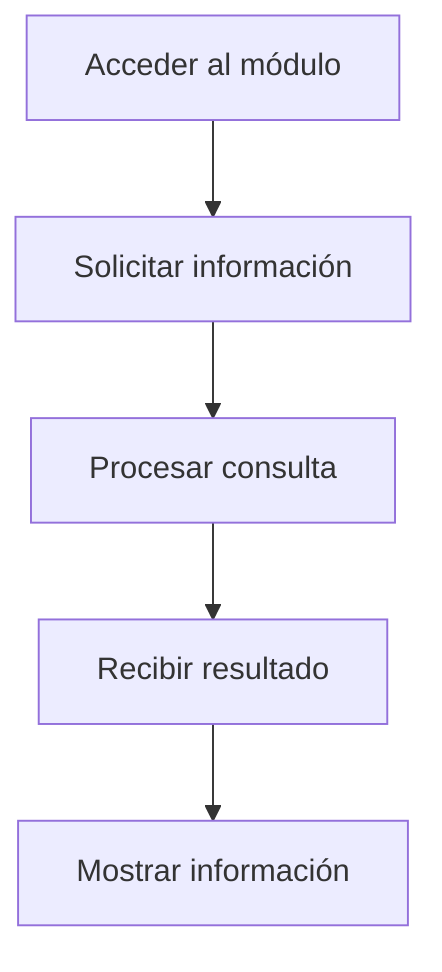

Cuando una consulta puede producir diferentes resultados, se contempla el flujo alternativo correspondiente.

El caso específico de Gestión de Animales incluye los estados de registros disponibles, ausencia de registros y error de consulta.

---

# 13. Estados de interacción

## 13.1 Estado de carga

Durante una consulta, la interfaz informa que la operación se encuentra en proceso.

Ejemplo:

```text
Cargando animales...
```

El estado de carga permite diferenciar una consulta en proceso de una consulta sin resultados.

## 13.2 Estado vacío

Cuando una consulta se completa correctamente pero no existen registros, se informa al usuario y se ofrece la posibilidad de crear el primer registro cuando corresponda.

Ejemplo:

```text
Aún no hay animales registrados.

[ + Registrar primer animal ]
```

## 13.3 Estado de error

Cuando una consulta no puede completarse, se informa el error y se ofrece una acción de recuperación.

Ejemplo:

```text
No se pudieron cargar los animales.

[ Reintentar ]
```

## 13.4 Diagrama general

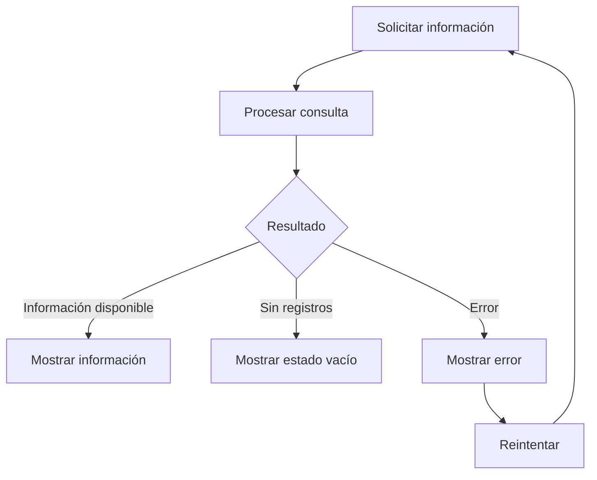

---

# 14. Flujo UX completo

El siguiente diagrama integra los principales recorridos de usuario definidos para GanadApp.

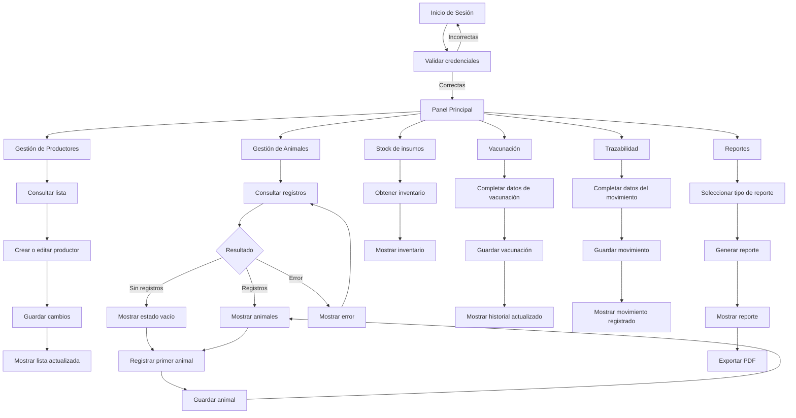

---

# 15. Criterios generales de UX

Los flujos definidos para GanadApp deben mantener los siguientes criterios:

## Navegación

* El Panel Principal funciona como punto central de acceso a los módulos.
* La navegación debe ser directa.
* Los módulos deben mantener denominaciones consistentes.

## Interacción

* Las acciones principales deben ser identificables.
* Cada operación debe seguir una secuencia comprensible.
* El sistema debe informar el resultado de las operaciones.

## Consulta

* El usuario debe conocer cuándo una información está siendo cargada.
* Debe diferenciarse la ausencia de registros de un error.
* Cuando exista un error recuperable, debe ofrecerse la posibilidad de reintentar.

## Registro

* El usuario debe completar la información correspondiente antes de guardar.
* El sistema debe confirmar el resultado de la operación.
* La información mostrada debe actualizarse después de un registro exitoso.

## Información crítica

La experiencia debe priorizar la información definida como relevante en el Panel Principal:

* Vacunación próxima.
* Vacunas pendientes.
* Stock bajo.
* Stock crítico.

## Consistencia

Los diferentes módulos deben seguir patrones de interacción equivalentes cuando realizan operaciones similares.

---

# 16. Relación con los componentes UI

Los flujos definidos en este documento utilizan los componentes establecidos en `componente-ui.md`.

La relación es:

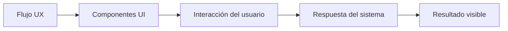

