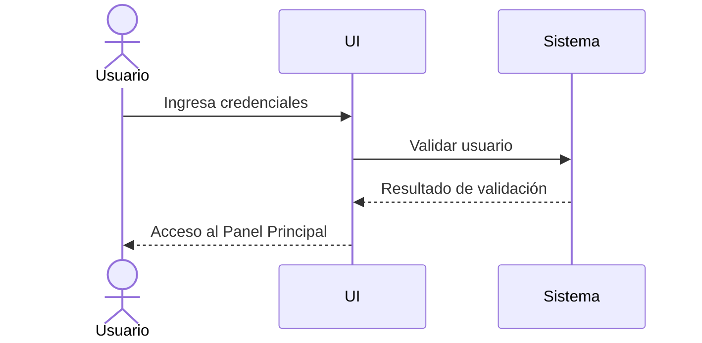
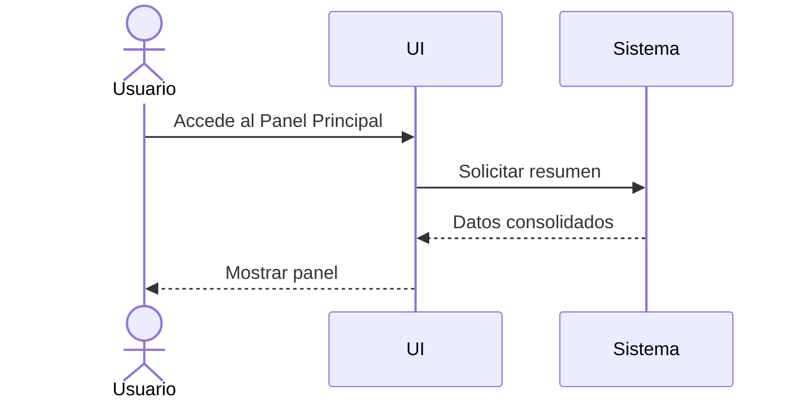
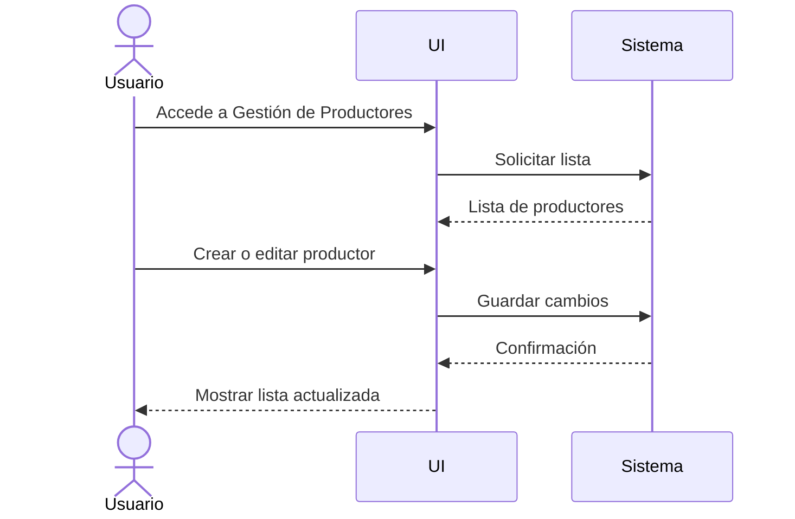
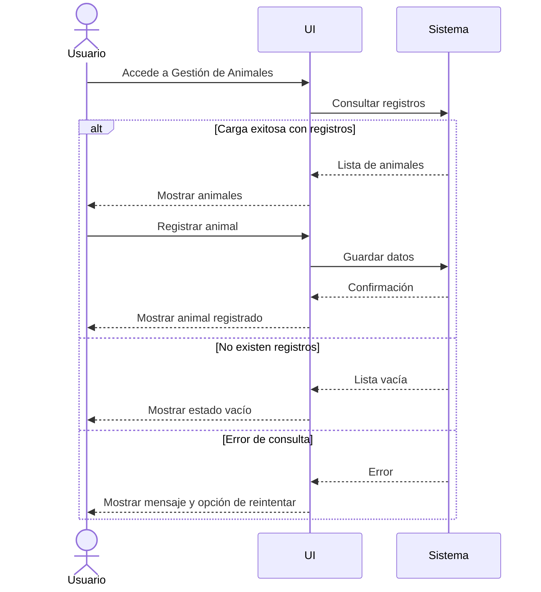
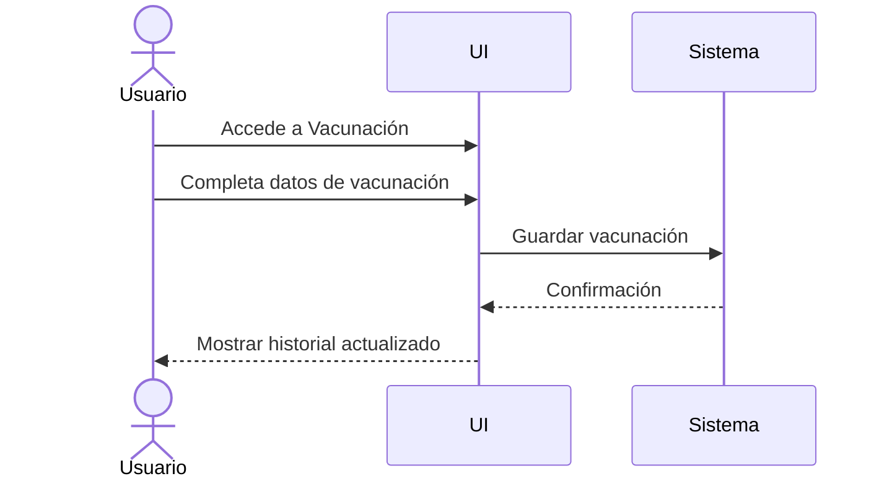
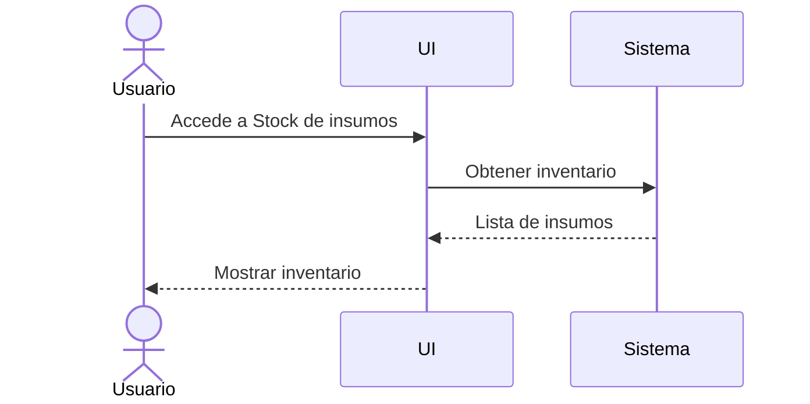
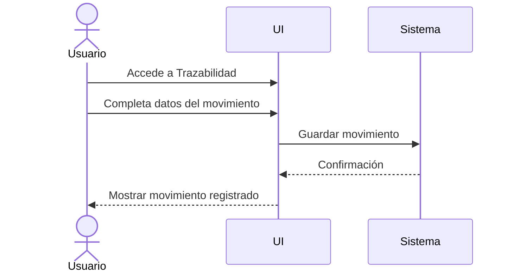
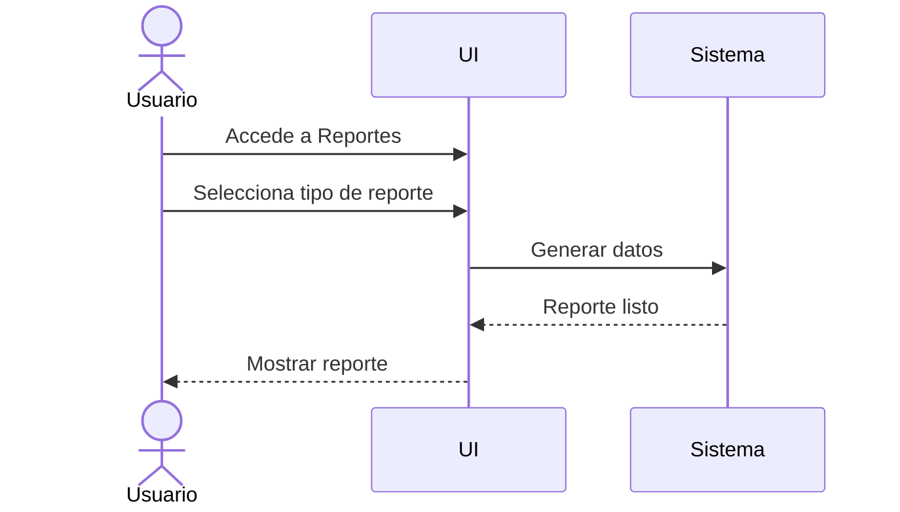

# Wireframes UX/UI - GanadApp

##  Navegación general

El Panel Principal funciona como punto central de navegación del sistema. Desde allí se puede acceder a los diferentes módulos mediante la barra superior y los módulos de acceso directo. El botón principal del hero permite acceder directamente a Gestión de Animales.

```mermaid
flowchart TD
 Panel[Panel Principal] 
 Login[Inicio de Sesión]
 Productores[Gestión de Productores] 
 Animales[Gestión de Animales] 
 Vacunacion[Vacunación] 
 Stock[Stock de insumos] 
 Trazabilidad[Trazabilidad] 
 Reportes[Reportes] 
 
 Panel --> Login 
 Panel --> Productores 
 Panel --> Animales 
 Panel --> Vacunacion 
 Panel --> Stock 
 Panel --> Trazabilidad 
 Panel --> Reportes 
 ```

La barra superior mantiene la misma estructura en todas las pantallas:

```text
+------------------------------------------------------+
| GANADAPP | TÍTULO DE LA PANTALLA | usuario           |
+------------------------------------------------------+
```

La acción principal de cada módulo se ubica inmediatamente debajo del header y mantiene una posición consistente.

## 1. Pantalla de Inicio de Sesión
   
### Objetivo

Iniciar sesión y acceder al Panel Principal.

### Wireframe

```text
+------------------------------------------------------+
| GANADAPP | INICIO DE SESIÓN | usuario                |
+------------------------------------------------------+
|                                                      |
| Usuario:     [____________________]                  |
| Contraseña:  [____________________]                  |
|                                                      |
|                 [ Ingresar ]                         |
|                                                      |
|              ¿Olvidó su contraseña?                 |
+------------------------------------------------------+
```
 
### Flujo 



### UX

* Campos mínimos.
* Mensajes de error claros.
* Validación de credenciales.
* Acceso al Panel Principal después de una autenticación exitosa.
  
## 2. Panel Principal

### Objetivo

Visualizar el estado general del sistema mediante resúmenes estadísticos, alertas pendientes y actividades recientes.

### Wireframe

```text
+------------------------------------------------------+
| GANADAPP | PANEL PRINCIPAL | usuario                 |
+------------------------------------------------------+
|                                                      |
| [ Gestión de Animales ]                              |
|                                                      |
| RESUMEN PRINCIPAL                                    |
| - Animales: 120                                     |
| - Vacunas pendientes: 8                              |
| - Stock crítico: 3                                   |
|                                                      |
| ALERTAS                                              |
| [ Vacunación próxima ]                               |
| [ Stock bajo ]                                       |
|                                                      |
| ACCESOS DIRECTOS                                     |
| [ Productores ] [ Animales ] [ Vacunación ]          |
| [ Stock ] [ Trazabilidad ] [ Reportes ]              |
+------------------------------------------------------+
```

### Flujo



### UX

* Información crítica priorizada.
* Tarjetas simples.
* Acceso directo a los módulos principales.
* Botón principal de Gestión de Animales ubicado debajo del header.
* Visión rápida del estado general.

## 3. Gestión de Productores

### Objetivo

Administrar productores registrados.

### Wireframe

```text
+------------------------------------------------------+
| GANADAPP | GESTIÓN DE PRODUCTORES | usuario          |
+------------------------------------------------------+
|                                                      |
| [ + Nuevo productor ]                                |
|                                                      |
| Nombre       | Teléfono | Localidad                  |
|------------------------------------------------------|
| Juan         | xxx      | Malargüe                   |
| Ana          | xxx      | Bardas                     |
+------------------------------------------------------+
```

### Flujo



### UX

* Acción principal ubicada debajo del header.
* Lista de productores visible.
* Datos organizados en columnas.
* Confirmación después de guardar cambios.

## 4. Gestión de Animales

### Objetivo

Administrar animales y consultar su estado sanitario.

### Wireframe - estado normal

```text
+------------------------------------------------------+
| GANADAPP | GESTIÓN DE ANIMALES | usuario             |
+------------------------------------------------------+
|                                                      |
| [ + Nuevo animal ]                                   |
|                                                      |
| ID | Raza   | Estado | Establecimiento              |
|------------------------------------------------------|
| 01 | Angus  | Sano   | Campo 1                      |
| 02 | Heref. | Alerta | Campo 2                      |
+------------------------------------------------------+
```

### Wireframe - estado de carga

```text
+------------------------------------------------------+
| GANADAPP | GESTIÓN DE ANIMALES | usuario             |
+------------------------------------------------------+
|                                                      |
| [ + Nuevo animal ]                                   |
|                                                      |
| Cargando animales...                                 |
| [████████████████████████]                           |
+------------------------------------------------------+
```

### Wireframe - estado vacío

```text
+------------------------------------------------------+
| GANADAPP | GESTIÓN DE ANIMALES | usuario             |
+------------------------------------------------------+
|                                                      |
| [ + Nuevo animal ]                                   |
|                                                      |
| Aún no hay animales registrados.                     |
|                                                      |
| [ + Registrar primer animal ]                        |
+------------------------------------------------------+
```

### Wireframe - estado de error

```text
+------------------------------------------------------+
| GANADAPP | GESTIÓN DE ANIMALES | usuario             |
+------------------------------------------------------+
|                                                      |
| [ + Nuevo animal ]                                   |
|                                                      |
| No se pudieron cargar los animales.                  |
|                                                      |
| [ Reintentar ]                                       |
+------------------------------------------------------+
```

### Flujo



### UX

* Identificación por ID único.
* Estado sanitario visible claramente.
* Acción principal ubicada debajo del header.
* Estado de carga visible durante la consulta.
* Estado vacío con mensaje explicativo y acción para registrar el primer animal.
* Estado de error con mensaje claro y opción de reintentar.

## 5. Vacunación

### Objetivo

Registrar y consultar vacunaciones.

### Wireframe

```text
+------------------------------------------------------+
| GANADAPP | VACUNACIÓN | usuario                      |
+------------------------------------------------------+
|                                                      |
| [ + Registrar vacunación ]                           |
|                                                      |
| Animal:     [____________________]                   |
| Vacuna:     [____________________]                   |
| Fecha:      [____________________]                   |
|                                                      |
| HISTORIAL                                            |
| Animal       | Vacuna       | Fecha                  |
|------------------------------------------------------|
| 01           | Antibrucélica| 20/08/2026             |
+------------------------------------------------------+
```

### Flujo



### UX

* Acción principal ubicada debajo del header.
* Datos de vacunación claramente identificados.
* Historial visible después del registro.
* Confirmación de la operación.

## 6. Stock de insumos

### Objetivo

Controlar el inventario de insumos.

### Wireframe

```text
+------------------------------------------------------+
| GANADAPP | STOCK DE INSUMOS | usuario                |
+------------------------------------------------------+
|                                                      |
| [ + Nuevo insumo ]                                   |
|                                                      |
| Insumo       | Cantidad | Estado                     |
|------------------------------------------------------|
| Vacuna       | 10       | OK                         |
| Alimento     | 2        | BAJO                       |
+------------------------------------------------------+
```

### Flujo



### UX

* Acción principal ubicada debajo del header.
* Cantidad disponible visible.
* Estado del stock claramente identificado.
* Priorización visual de insumos con stock bajo.

## 7. Trazabilidad

### Objetivo

Registrar y consultar los movimientos del ganado.

### Wireframe

```text
+------------------------------------------------------+
| GANADAPP | TRAZABILIDAD | usuario                    |
+------------------------------------------------------+
|                                                      |
| [ + Registrar movimiento ]                           |
|                                                      |
| Animal:     [____________________]                   |
| Origen:     [____________________]                   |
| Destino:    [____________________]                   |
| Fecha:      [____________________]                   |
|                                                      |
| MOVIMIENTOS RECIENTES                                |
| Animal | Origen | Destino | Fecha                    |
|------------------------------------------------------|
| 01     | Campo 1| Campo 2 | 20/08/2026               |
+------------------------------------------------------+
```

### Flujo



### UX

* Acción principal ubicada debajo del header.
* Origen y destino claramente diferenciados.
* Fecha del movimiento visible.
* Historial de movimientos disponible para consulta.

## 8. Reportes

### Objetivo

Generar análisis del sistema.

### Wireframe

```text
+------------------------------------------------------+
| GANADAPP | REPORTES | usuario                        |
+------------------------------------------------------+
|                                                      |
| [ Generar reporte ]                                  |
|                                                      |
| REPORTES DISPONIBLES                                 |
|                                                      |
| [ Ganado total ]                                     |
| [ Sanidad ]                                          |
| [ Stock ]                                            |
|                                                      |
| [ Exportar PDF ]                                     |
+------------------------------------------------------+
```

### Flujo



### UX

* Acción principal ubicada debajo del header.
* Tipos de reporte claramente diferenciados.
* Opción de exportación disponible después de generar el reporte.
* Confirmación cuando el reporte está listo.