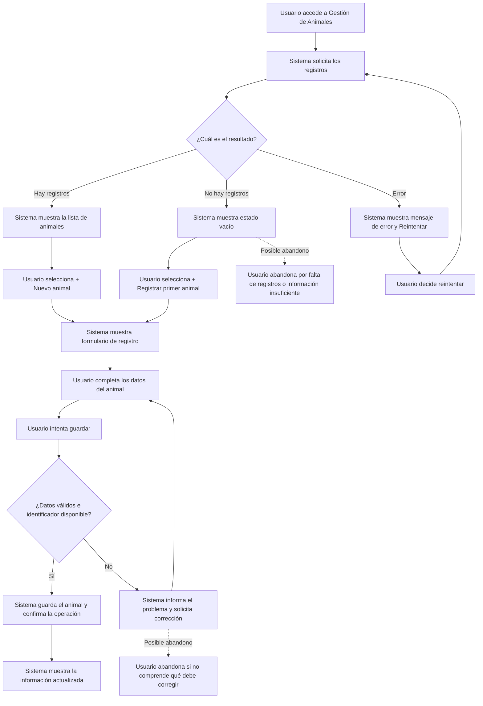
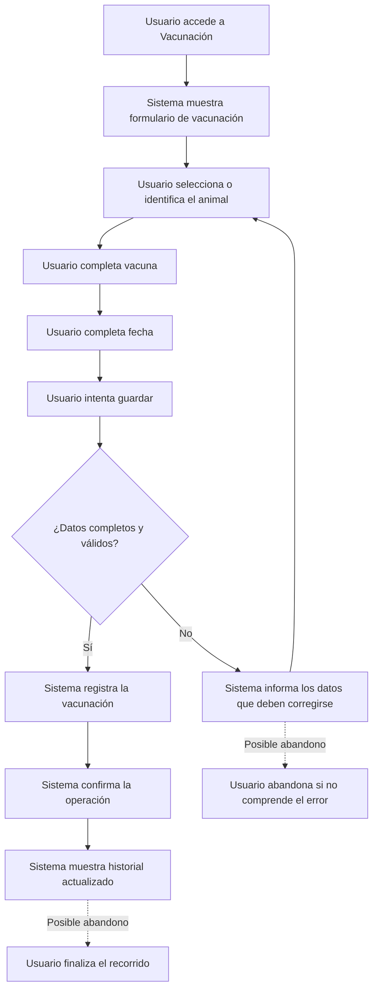

# Personas y recorridos de usuario — GanadApp

## 1. Objetivo

Este documento define las personas y los recorridos de usuario principales de GanadApp para orientar el diseño de la interfaz desde criterios HCI.

Las personas son perfiles ficticios construidos a partir de los roles definidos en la especificación del sistema:

* Productor ganadero.
* Personal de campo.

Los recorridos se concentran en dos operaciones críticas ya contempladas por GanadApp:

1. Gestión de animales.
2. Registro de vacunaciones.

El objetivo es identificar qué necesita hacer el usuario, qué información debe recibir de la interfaz y en qué puntos puede abandonar el recorrido.

---

# 2. Personas

## 2.1 Persona 1 — Productor ganadero

| Aspecto               | Descripción                                                                                                                                           |
| --------------------- | ----------------------------------------------------------------------------------------------------------------------------------------------------- |
| Nombre                | Carlos                                                                                                                                                |
| Rol                   | Productor ganadero                                                                                                                                    |
| Objetivo principal    | Consultar y mantener organizada la información de los animales y el estado sanitario de su establecimiento.                                           |
| Frustración principal | Tener información dispersa y necesitar consultar diferentes registros para conocer el estado de los animales.                                         |
| Contexto de uso       | Utiliza GanadApp desde una computadora o dispositivo estándar para consultar información del establecimiento y supervisar las operaciones realizadas. |

### Necesidades principales

* Consultar rápidamente los animales registrados.
* Identificar cada animal mediante su identificador único.
* Conocer el estado sanitario de los animales.
* Consultar información de vacunaciones.
* Recibir confirmación cuando una operación se registra correctamente.
* Diferenciar información disponible, ausencia de registros y errores de consulta.

### Implicaciones para la interfaz

La interfaz debe priorizar:

* identificación clara del módulo actual;
* información relevante visible;
* acciones principales claramente identificadas;
* estados de carga, vacío y error diferenciados;
* confirmaciones después de operaciones de registro.

---

## 2.2 Persona 2 — Personal de campo

| Aspecto               | Descripción                                                                                                                                                     |
| --------------------- | --------------------------------------------------------------------------------------------------------------------------------------------------------------- |
| Nombre                | Martín                                                                                                                                                          |
| Rol                   | Personal de campo                                                                                                                                               |
| Objetivo principal    | Registrar información operativa de los animales y sus eventos sanitarios.                                                                                       |
| Frustración principal | Tener que recordar o registrar manualmente información de animales y vacunaciones sin una referencia centralizada.                                              |
| Contexto de uso       | Utiliza GanadApp durante las tareas operativas del establecimiento, principalmente para cargar y consultar información correspondiente a sus responsabilidades. |

### Necesidades principales

* Acceder directamente a la gestión de animales.
* Identificar el animal sobre el que realizará una operación.
* Completar datos sanitarios sin ambigüedad.
* Registrar vacunaciones.
* Verificar que la información fue guardada.
* Consultar el historial actualizado.

### Implicaciones para la interfaz

La interfaz debe:

* presentar las acciones principales de forma directa;
* utilizar etiquetas claras para los campos;
* evitar que el usuario pueda enviar información incompleta;
* informar los errores antes o durante el registro;
* mostrar el resultado actualizado después de una operación exitosa.

---

# 3. Recorrido crítico 1 — Gestión de animales

## Objetivo

Permitir que el usuario acceda al módulo de animales, consulte los registros existentes y, cuando corresponda, inicie el registro de un nuevo animal.

Este recorrido se relaciona principalmente con:

* RF-03: registrar animales individualmente.
* RF-04: actualizar y consultar información de animales.
* RF-05: identificar cada animal mediante un identificador único.
* RF-06: almacenar información básica del animal.
* CA-04: registrar un animal con sus datos principales.
* CA-05: rechazar identificadores duplicados.
* CA-06: consultar información registrada.

## Recorrido

### Puntos de posible abandono y mitigación

| Punto                   | Riesgo de abandono                                               | Mitigación                                                                       |
| ----------------------- | ---------------------------------------------------------------- | -------------------------------------------------------------------------------- |
| Estado vacío            | El usuario puede interpretar que el sistema no funciona.         | Mensaje explícito de ausencia de registros y acción `+ Registrar primer animal`. |
| Error de consulta       | El usuario puede quedar sin saber cómo continuar.                | Mensaje de error claro y acción `Reintentar`.                                    |
| Formulario              | El usuario puede no saber qué información debe ingresar.         | Etiquetas claras y campos identificados.                                         |
| Identificador duplicado | El usuario puede no comprender por qué no puede guardar.         | Informar específicamente que el identificador ya existe y solicitar corrección.  |
| Después de guardar      | El usuario puede no saber si la operación terminó correctamente. | Confirmación y actualización visible de la información.                          |

---

# 4. Recorrido crítico 2 — Registro de vacunación

## Objetivo

Permitir registrar una vacunación asociada a un animal y mostrar el historial actualizado.

Este recorrido se relaciona principalmente con:

* RF-07: registrar eventos asociados a los animales.
* RF-08: registrar vacunaciones y otros eventos sanitarios.
* RF-09: consultar el historial de eventos.
* CA-07: registrar un evento sanitario asociado a un animal.
* CA-08: rechazar datos inválidos o animales inexistentes.
* CA-09: consultar el historial de eventos.

## Recorrido

### Puntos de posible abandono y mitigación

| Punto                     | Riesgo de abandono                                                                | Mitigación                                                          |
| ------------------------- | --------------------------------------------------------------------------------- | ------------------------------------------------------------------- |
| Identificación del animal | El usuario puede ingresar un animal inexistente o no identificarlo correctamente. | Campo claramente identificado y validación antes de guardar.        |
| Datos incompletos         | El usuario puede intentar guardar sin completar información necesaria.            | Validación de campos requeridos y mensajes específicos.             |
| Error de validación       | El usuario puede no comprender qué debe modificar.                                | Mostrar el problema junto con la posibilidad de corregir los datos. |
| Confirmación              | El usuario puede no saber si la vacunación quedó registrada.                      | Confirmación explícita y actualización inmediata del historial.     |

---

# 5. Relación entre personas y recorridos

| Persona            |           Gestión de animales |              Registro de vacunación |
| ------------------ | ----------------------------: | ----------------------------------: |
| Productor ganadero |        Consulta y supervisión |   Consulta de información sanitaria |
| Personal de campo  | Registro y consulta operativa | Registro y consulta de vacunaciones |

Los dos recorridos son relevantes para ambos perfiles, aunque el tipo de interacción puede variar según las responsabilidades y permisos definidos por el sistema.

---

# 6. Criterios HCI derivados

A partir de las personas y recorridos se establecen los siguientes criterios:

1. La acción principal de cada pantalla debe ser identificable.
2. El usuario debe conocer en qué módulo se encuentra.
3. Los campos deben utilizar etiquetas comprensibles.
4. Los errores deben indicar qué debe corregirse.
5. Los estados de carga, vacío y error deben diferenciarse.
6. El sistema debe confirmar las operaciones exitosas.
7. Después de un registro exitoso debe mostrarse la información actualizada.
8. Las dos pantallas críticas deben poder utilizarse mediante teclado.
9. Las dos pantallas críticas deben mantener contraste de texto y elementos suficiente para el nivel AA definido para el alcance del TP.
